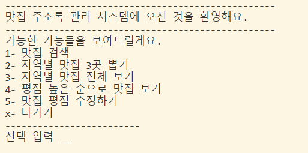
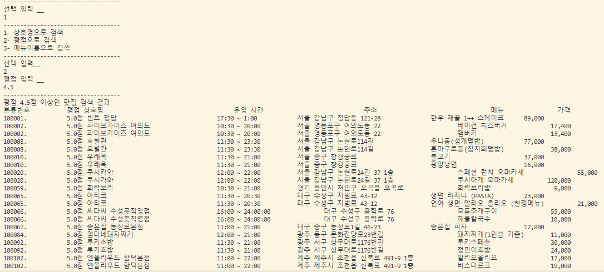
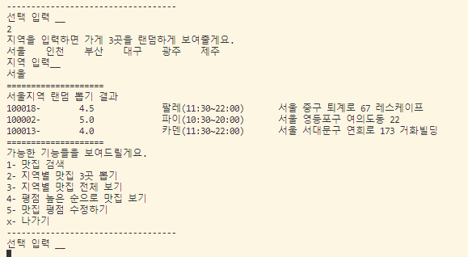
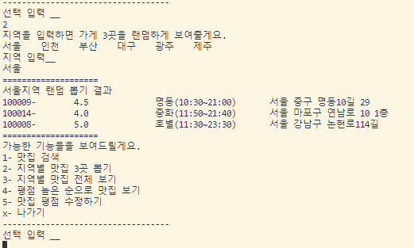

## Must-go Address Book Management System -Java

객체지향성 분석과 디자인의 개념을 활용한 좋은 입지 주소관리 시스템.
최소 코드는 GUI에 작성되며 엔티티도 분리됩니다.
인터페이스는 콘솔 기반입니다.
이 프로젝트는 "객체 지향 분석 및 설계" 과정에서 설계되었습니다.

프로젝트의 클래스 다이어그램도 데이터베이스 스키마 파일과 함께 제공됩니다.

## Interface

## Actors

Actors는 다음과 같습니다:

- 맛집 찾는 사람
- 관리자

## Use Cases

행위자를 결정한 후, 사용 사례 분석의 두 번째 단계는 각 행위자가 시스템에 대해 수행해야 할 작업을 결정하는 것입니다. 각 작업은 시스템이 사용될 한 가지 특정한 방법을 나타내기 때문에 사용 사례라고 불립니다.

즉, 행위자가 고객의 문제를 해결하기 위해 시스템을 사용할 때 필요한 사용 사례만 나열됩니다.

### 맛집 찾는 사람

- 맛집 찾기
- ... 상호명으로 
- ... 평점으로 
- ... 메뉴로 
- 지역별 맛집 랜덤 뽑기
- 평점 높은 순으로 맛집 보기

### 관리자

- 맛집 평점 수정
